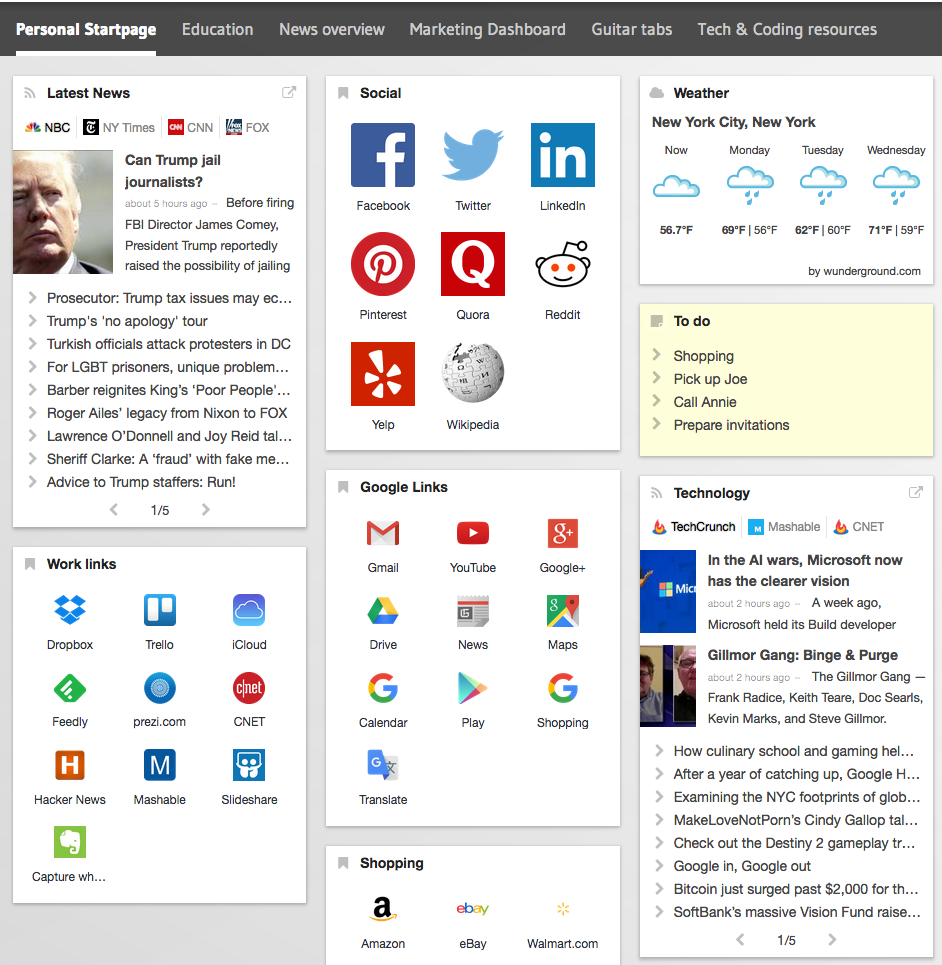

# Manage your bookmark cross different browsers

I was a heavy google chrome user, but since I a little bit scared about their privacy policy. I was seeking for alternative, turns of Opera is my first choose. The first problem I hit strait away is bookmarks, the more I use a browser the more I addict to it. All my collections of bookmarks need to migrate, is there a proper solutions for this? It depends. But I find a website that change the way I manage my bookmarks in a nice looking UI, and it's pretty easy to use. That is [start.me](https://start.me).

The first thing you will notice is Start.Me is pretty much looks like a portal, things like iGoogle. The functionality is similar too. You can add tabs to organize your things. Widgets are also available to use, such like weather or todo list.

The only thing I was interested is bookmark manager. It allows you to login using google account and access it cross all your devices. Yes, it's responsive. So not just your desktop browsers, but also on your mobile. This is way I would like to keep my bookmarks in one place and cross all browsers.

Of course, you would still have privacy concerns here. But this is how I made my decision, I don't like one service controls all my data.
