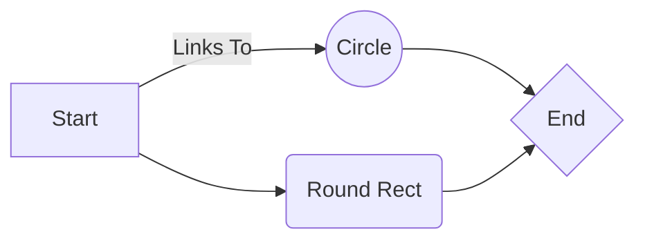
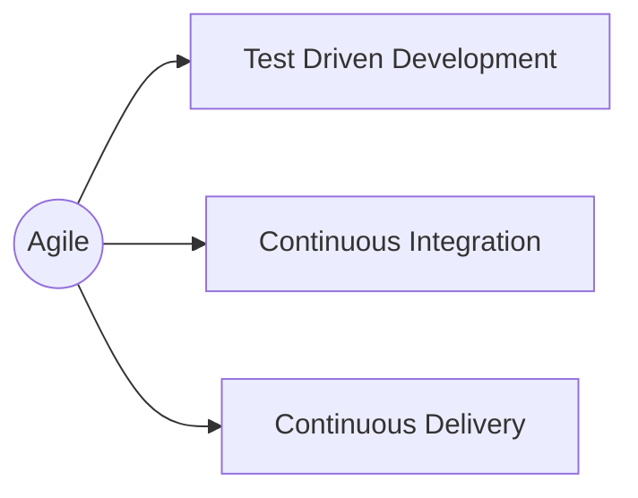

I really like the idea to embed a chart in the makedown with a very simple and readable syntax. And gatsby already have a plugin for it. [gatsby-remark-graph](https://www.gatsbyjs.org/packages/gatsby-remark-graph/)

This is a test chart with mermaid plugin.

